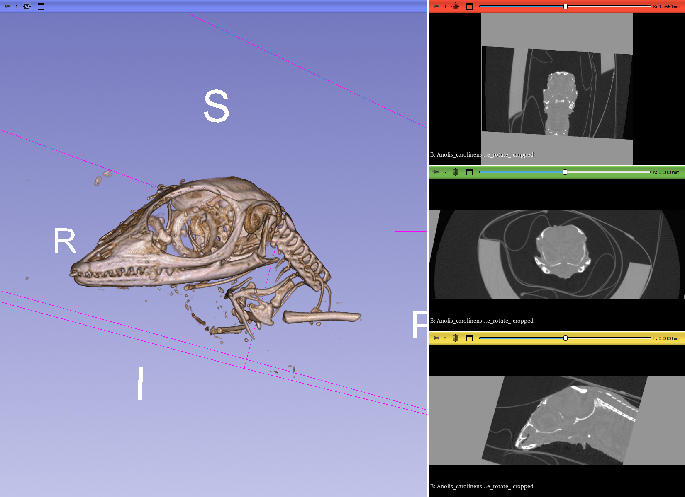

## MorphoDepot Repository
Repository for segmentation of a specimen scan.  See [this JSON file](MorphoDepotAccession.json) for specimen details.
* Species: Anolis carolinensis
* Modality: Micro CT (or synchrotron)
* Contrast: No
* Dimensions: (416, 546, 356)
* Spacing (mm): (0.01799999925, 0.01799999925, 0.01799999925)

## Screenshots

_Screenshot of specimen scan_
